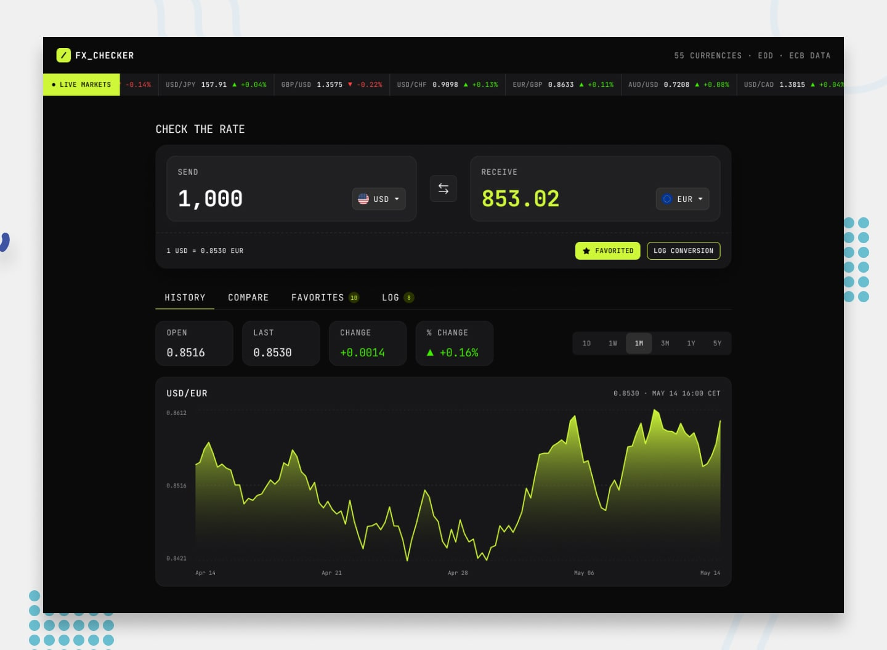

# Frontend Mentor - FX Checker

This is a solution to the [FX Checker challenge on Frontend Mentor](https://www.frontendmentor.io/challenges/foreign-exchange-currency-converter). Frontend Mentor challenges help you improve your coding skills by building realistic projects.

## Welcome! 👋

### Links

- My Solution at : [Vercel](https://foreign-exchange-currency-yehudahason.vercel.app/)

### Built with

- [Next.js](https://nextjs.org/) - React framework

## Author

- Frontend Mentor - [Yehuda Hason](https://www.frontendmentor.io/profile/yehudahason)
